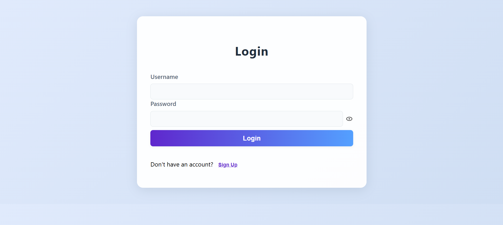
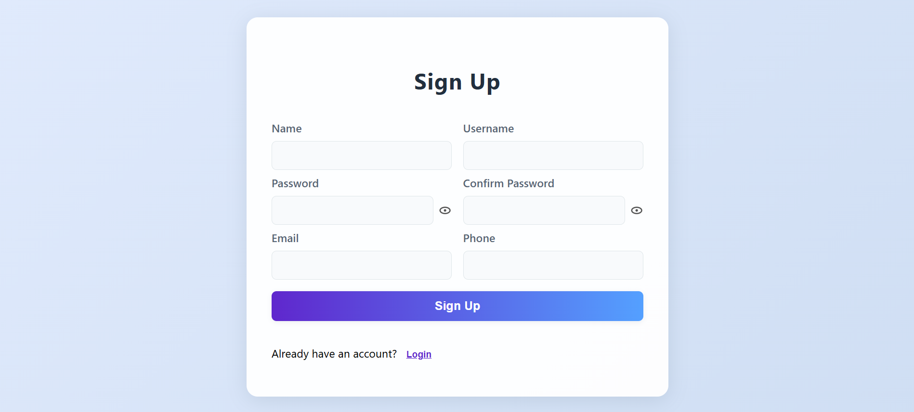

# Login & Sign-Up React App

## Overview
A simple, responsive React application with Login and Sign-Up screens, routing, validation, and error messages. Components are reusable and styled for a modern look.

## Features
- Login and Sign-Up screens
- Routing between screens
- Input validation (Name, Username, Password, Confirm, Email, Phone)
- Error messages below fields
- Responsive design
- Reusable components

## How to Run Locally
1. **Install dependencies:**
	```powershell
	cd login-signup-app
	npm install
	```
2. **Start the development server:**
	```powershell
	npm start
	```
3. Open [http://localhost:3000](http://localhost:3000) in your browser.

## Submission Guidelines
1. Submit the source code of your React Application.
2. Include a brief README file with instructions on how to run the application locally.
3. Provide screenshots or a live demo link showcasing your app.


## Screenshots & Demo

### Screenshots



### Demo Video
[Watch Demo Video](./screenshots/demo.mp4)

## Live Demo
If deployed, add your live demo link here.

## Additional Notes
- You may use any external libraries for styling, state management, or other functionalities, but ensure that the core functionality of the App is implemented using React.
